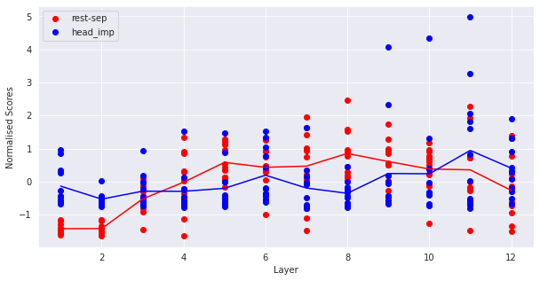
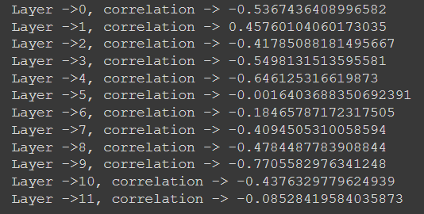

# Prune-The-SEP-attendors
Experiments on pruning BERT attention heads with different strategies


## Idea:
The paper [Are Sixteen Heads Really Better than One?](https://arxiv.org/abs/1905.10650) opined that many attention heads of pretrained BERT contribute little to model's predictions
and can be pruned based on a metric called `head_imp_score` which is calculated using method put forward in the paper itself. The method involves masking the heads using `head_mask` and then calculating the gradients of loss w.r.t to `head_mask` and averaging these gradients over whole evaluation dataset. After calculating the head_importance, the heads whose `head_imp` is less than some threshold can be pruned without incurring much loss in performance, thereby reducing the model size and increasing latency (which can be benificial) when deploying the model. But, this method requires storing the model's activations in memory during the evaluation phase to calculate head importance matrix (because we call `.backward()` and therefore can't work with `torch.no_grad()`). 

To remedy this, there's another metric which can act as an alternate for `head_imp_score` which is `REST-SEP attention`. In this method, we calculate a matrix of similar shape as  `head_imp` matrix i.e `(num_hidden_layer, num_attention_heads)` where the `[i,j]` element of matrix is the average attention the tokens pay to `[SEP]` token. The paper [What Does BERT Look At? An Analysis of BERT's Attention](https://arxiv.org/abs/1906.04341) shows that each attention head can specialise in a particular aspect of dependency parsing. for.eg head 7 in layer 5 can make the verb in the sentences attend to their subject. In that case the rest of the words which are not verb will attend to `[SEP]` token. Therefore, `[SEP]` token can be used as 'no-op' by the other tokens. In that case, the heads which pay too much attention to `[SEP]` tokens can be pruned because their contribution may be negligible to the model's output.

To verify this, I trained a BERT model on [Quora Question Pairs](https://gluebenchmark.com/tasks) dataset using the [transformers](https://huggingface.co/transformers/) library.The training script is available in `train.py`. The model achieved 89% validation accuracy and can be accessed from [huggingface model hub](https://huggingface.co/A-bhimany-u08/bert-base-cased-qqp) like so:
```
from transformers import BertForSequenceClassification

model = BertForSequenceClassification.from_pretrained('A-bhimany-u08/bert-base-cased-qqp')
```

## Experiments: 
(code of experiments are available in this [colab notebook](https://colab.research.google.com/drive/1TfB95lpwpTJZZVVjKGwHtG5iv4dPgpsO?usp=sharing)) 

I calculated `head_imp` matrix and `rest_sep_attn` matrix for the model and plotted their correlation.

### Correlation between head importance scores and rest_sep attention scores.



We can see that after layer 6 the tokens pay high attention to `[SEP]`. The average head importance scores and rest_sep attention scores beyong this layer have a high negative correlation (average rest_sep attention for a layer goes down as head_imp goes up and vice versa).



This shows that heads with high res_sep attn can be chopped off in the same way as we can prune the heads with low head_imp score.
Empirically, I noticed that pruning according to res_sep attn scores led to less decrease in full model accuracy than pruning according to head_imp scores after removing the same number of heads, as shown in graphs below. The graph also shows that pruning the heads randomly does not preserve the full model's performance for long and we can immediately see the faster deterioration in that case.


